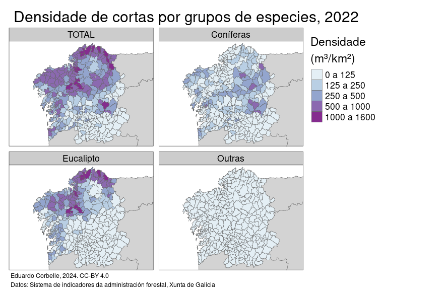

### Serie histórica do volume de cortas en Galicia, por grupos de especies, e distribución espacial a nivel municipal 1960-2021

Datos orixinais: 

* [Estadística Forestal de España (1940-1971)](https://portal-miteco-stage.adobecqms.net/es/biodiversidad/estadisticas/forestal_estadistica_forestal_1940_1971.html)
* [Anuarios de Estadística Agraria (1972-2004)](https://www.mapa.gob.es/app/biblioteca/articulos/rev_numero.asp?codrevista=AEA)
* [Anuarios de Estadística Forestal (2005-2021)](https://www.miteco.gob.es/es/biodiversidad/estadisticas/forestal_anuarios_todos.html)
* [Observatorio Forestal de Galicia](https://ovmediorural.xunta.gal/gl/consultas-publicas/observatorio-forestal)

_______________________________

